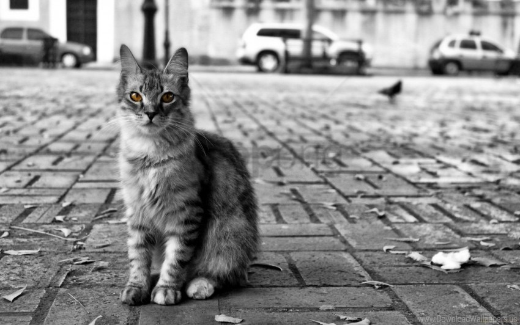

<style>
   section {
       font-size: 24px;
   }
</style>

# Implantación de contenido multimedia

---

## Contenidos

- Imágenes
- Audio
- Video

---

## Imagenes

Las imágenes representan de media más del 60% de los bytes necesarios par cargar una página web completa :open_mouth:.

En este escenario, integrar imágenes que se adapten a los diferentes tamaños del _viewport_ y _casos de uso_ de forma suave y optimizando tiempos de carga es una habilidad imprescindible para el diseño moderno de páginas web.

---

### Imagenes en HTML5

Si al potente elemento :muscle: `img` :muscle:, que descarga, decodifica y renderiza contenido le sumamos que los navegadores modernos soportan prácticamente cualquier formato de imagen, tenemos un _win win_ de manual. 

Pero como dijo alguien alguna vez en un anuncio de ruedas...

> ***La potencia sin control no sirve de nada***

así que por aquí :arrow_down: dejo una lista de consejos _zen_ :pray:

---

####  Usa tamaños relativos para las imagenes


Tienes para elegir (%, vh, vw, em, ex, rem, ch, vmin o vmax... :sweat:) así que déjate de _px_ para todo sino quieres acabar en :crystal_ball: ***_stack overflow_*** :crystal_ball: como este figura, al que la imagen le desborda el contenedor


---

y por si las :fly: :fly: es buena idea :bulb: hacer algo así

```css
img, embed, object, video {
  max-width: 100%;
}
```
limitando la anchura máxima que pueden tomar los elementos multimedia.

---

#### Usa las propiedades ***srcset*** y ***sizes*** del _tag_ `img`
  
Así ayudaras al navegador a elegir la mejor imagen para utilizar en función de las condiciones del dispositivo.

\- ¿***srcset***, ***sizes***... ayudar YO al NAVEGADOR :astonished:...? No entiendo nada _hulio_ :confused:
\- Son propiedades de :muscle: `img` :muscle: para resolver el _art direction problem_...
\- ¿_art direc_... _whaaaat_? 
\- :eye: :arrow_down:

---

##### _Art direction problem_

:wolf: en la pantalla de mi escritorio


---

En la pantalla de mi :dollar: _Iphone_ :dollar: ... bonitos :evergreen_tree: :evergreen_tree: :evergreen_tree:


:rocket: Houston, tenemos un _art direction problem_... ¿qué hacemos?


---

Pues hacemos algo así 

```css
@media (max-width: 320px) {
  .img-lobo {
    transform: scale(1.5)
  }
}
```

y ya... 

:expressionless: mi perro tiene problemas más graves y sin nombre propio en inglés

---

:rage: Prueba con el gato listillo :arrow_down:



---


---

- Usa el elemento `picture` cuando quieras especificar diferentes imagenes dependiendo de las características del dispositivo.
- 
- If your page only has one or two images and these are not used elsewhere on your site, consider using inline images to reduce file requests.

