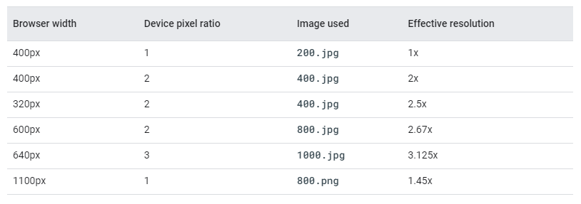

<style>
   section {
       font-size: 24px;
   }
</style>

# Implantación de contenido multimedia

---

## Contenidos

- Imágenes
- Audio
- Video

---

## Imagenes

Las imágenes representan de media más del 60% de los bytes necesarios par cargar una página web completa :open_mouth:.

En este escenario, integrar imágenes que se adapten a los diferentes tamaños del _viewport_ y _casos de uso_ de forma suave y optimizando tiempos de carga es una habilidad imprescindible para el diseño moderno de páginas web.

---

### Imagenes en HTML5

Si al potente elemento :muscle: `img` :muscle:, que descarga, decodifica y renderiza contenido le sumamos que los navegadores modernos soportan prácticamente cualquier formato de imagen, tenemos un _win win_ de manual. 

Pero como dijo alguien alguna vez en un anuncio de ruedas...

> ***La potencia sin control no sirve de nada***

así que por aquí :arrow_down: dejo una lista de consejos _zen_ :pray:

---

####  Usa tamaños relativos para las imagenes

Tienes para elegir (%, vh, vw, em, ex, rem, ch, vmin o vmax... :sweat:) así que déjate de _px_ para todo sino quieres acabar en :crystal_ball: ***stack overflow*** :crystal_ball: como este figura, al que la imagen le desborda el contenedor


---

y por si las :fly: :fly: es buena idea :bulb: hacer algo así

```css
img, embed, object, video {
  max-width: 100%;
}
```
limitando la anchura máxima que pueden tomar los elementos multimedia.

---

#### Usa las propiedades ***srcset*** y ***sizes*** del _tag_ :muscle: `img` :muscle: o... el elemento `picture`
  
Así ayudaras al navegador a elegir la mejor imagen para utilizar en función de las condiciones del dispositivo.

\- ¿***srcset***, ***sizes***, `picture`... ayudar YO al NAVEGADOR :astonished:...? No entiendo nada _hulio_ :confused:
\- Son la solución **HTML** al _art direction problem_...
\- ¿_art direc_... _whaaaat_? 
\- :eye: :arrow_down:

---

##### _Art direction problem_

:wolf: en la pantalla de mi escritorio


---

En la pantalla de mi :dollar: _Iphone_ :dollar: ... bonitos :evergreen_tree: :evergreen_tree: :evergreen_tree:


:rocket: Houston, tenemos un _art direction problem_... ¿qué hacemos?


---

Pues hacemos algo así 

```css
@media (max-width: 320px) {
  .img-lobo {
    transform: scale(1.5)
  }
}
```

y arreglado...

:expressionless: mi perro tiene problemas más graves y sin nombre propio en inglés

---

:rage: Prueba con el gato, listillo :arrow_down:


---

:sweat_smile: puedo contar los pixeles con los dedos de la mano ([aqui :link:](https://codepen.io/taciocamba/pen/porryYo))


Con un escalado no podemos decidir en que zona de la imagen hacer foco y la imagen se ve muy pixelada cuando la ampliamos.

----

La solución al _art direction problem_ consiste en disponer de **varias versiones de la misma imagen** en las que nos centramos en lo que queremos mostrar.

Veamos esto con ***srcset***, ***sizes*** y los gatos 
```css

```

:zap: Resumen rápido :arrow_down:

---

**srcset** :arrow_right: lista separada por comas de
```css
srcset="ruta-imagen-1 ancho-w-1,
        ruta-imagen-2 ancho-w-2"
```

:warning: `tamaño-w-x` es el ancho intrínseco de la imagen ([mas info :link:](https://developer.mozilla.org/en-US/docs/Glossary/Intrinsic_Size))

---

**sizes** :arrow_right: lista separada por comas de
```css
sizes="condicion-@media ancho-px-1,
        ancho-px-2"
```

Ahora sí, `ancho-px-x` es el ancho en px CSS de toda la vida que ocupará la imagen cuando se cumpla `condicion-@media`

---

¿Se puede hacer mejor?

Por supuesto, con el elemento :sunglasses: `picture` :sunglasses: (cuidado que es su primerito dia en navegadores)

```css
<picture>
<source media="(max-width: 320px)" srcset="assets/gato-ciudad-280w.jpg">

</picture>
```

de todos modos, [aqui :link:](https://googlesamples.github.io/web-fundamentals/fundamentals/design-and-ux/responsive/media.html) hay un ejemplo de alguien mucho mas listo

¿Y si os digo que también se hace todo lo de arriba no solo en función del ancho de pantalla del dispositivo sino también de su densidad de pixeles? :arrow_down:

 ---


 Una tabla (y un [ejemplo :link:](https://googlesamples.github.io/web-fundamentals/fundamentals/design-and-ux/responsive/sizes.html)) vale más que mil palabras... y un figura preguntando en [:crystal_ball: _stack overflow_ :crystal_ball: :link:](https://stackoverflow.com/questions/8785643/what-exactly-is-device-pixel-ratio) ya ni os digo

 

 

 TL;DR... ¿una :zap: actividad :zap: y tal...?

 ---

 #### Actividad 1

1) Elegid una imagen que os guste (:warning: con una resolución decente pero sin pasarse)
2) Haced 2 versiones más de ella (una para dispositivos móviles y otra para _tablets_) usando :muscle: _paint_ :muscle: o el editor que querais.
3) Usad ***srcset*** y ***sizes*** para cargarlas de forma condicional en función del ancho de pantalla.
4) Usad :sunglasses:`picture`:sunglasses: para hacer lo de arriba :arrow_up:

:zap: ***20 MINUTOS*** :zap:


---

#### ImageMagick

En la :zap: actividad :zap: anterior, os pedía que versionarais una imagen usando un editor de vuestra elección, así, a la buena de Dios.

Redimensionar, rotar, difuminar, cambiar la opacidad, recortar... y sobre todo **CONVERTIR** entre formatos de imagen son habilidades a dominar en este mundillo... y para dominar algo hacen falta buenas herramientas :wrench::nut_and_bolt::hammer:

:sparkles: Os presento [ImageMagick :link:](https://imagemagick.org) :sparkles: :arrow_down:

---

Espera, espera... eso es una herramienta de consola de comandos :scream::scream::scream:

Efectivamente... bienvenidos al mundo real :japanese_ogre::japanese_ogre: 

La parte buena es que os podéis hacer los _hackers_ delante de vuestras abuelas mientras redimensionais vuestro avatar de _Fortnite_.

Pero lo mas importante es que una vez dominada el flujo de trabajo se agiliza y además os permite automatizar tareas comunes con _scripting_.

Me has convencido, dale :fist::fist:

---

1) Instala desde [aqui :link:](https://imagemagick.org/script/download.php)
2) Verifica que todo va bien haciendo esto en la terminal :arrow_down:

```
magick logo: logo.gif
magick identify logo.gif
magick logo.gif win:
```

3) Si estas en Windows y no te funciona :disappointed::disappointed: instala este [dll :link:](https://docs.microsoft.com/en-us/cpp/windows/latest-supported-vc-redist?view=msvc-160) y si todo va bien...


---

##### Vale, ahora unos ejemplos

1) Convertimos el :wolf: de antes de .jpg a [.webp :link:](https://developers.google.com/speed/webp)

```
magick lobo-en-el-bosque.jpg -quality 50 -define webp:lossless=true lobo-en-el-bosque.webp
```

2) Redimensionamos los :cat::cat: de antes para que se queden a la mitad

```
magick gato-ciudad-680w.jpg -resize 50% gato-ciudad-340w.png 
```

3) Ahora quiero el logo de :sparkles:ImageMagick:sparkles: en b/n

```
magick imagemagick.jpg -monochrome imagemagick-bn-mal.png
```

---


4) Y para acabar, las tres primeras de golpe con la calculadora humana

```
magick actividad-calculo.jpg -resize 50% -monochrome actividad-calculo-magick.png
```

Por [aqui :link:](https://imagemagick.org/script/command-line-processing.php) tenéis la referencia para montaros bien los comandos de terminal :muscle:...

y a continuación... :grimacing::grimacing:

 :zap:actividad:zap: :arrow_down:

 ---
 #### Actividad 2

 1) Instala :sparkles:ImageMagick:sparkles: como vimos :arrow_up:
 2) Busca una imagen cualquiera en alta resolución
 3) Redimensionala al 75%, cambia su orientación y aplica un desenfoque (_blur_) a tu elección
 6) Conviertela a formato _webp_ sin pérdidas (_lossless_)
 7) Compara el tamaño en disco de la imagen original con la nueva...

y me contáis el resultado :smiley::smiley:

:zap: ***20 MINUTOS*** :zap:

