<style>
   section {
       font-size: 24px;
   }
</style>

# Implantación de contenido multimedia

---

## Contenidos

- [Imagenes](#imagenes)
- [Audio](#audio)
- [Video](#video)

---

## Imagenes

Las imágenes representan de media más del 60% de los bytes necesarios par cargar una página web completa :open_mouth:.

En este escenario, integrar imágenes que se adapten a los diferentes tamaños del _viewport_ y _casos de uso_ de forma suave y optimizando tiempos de carga es una habilidad imprescindible para el diseño moderno de páginas web.

---

### Imagenes en HTML5

Si al potente elemento :muscle: `img` :muscle:, que descarga, decodifica y renderiza contenido le sumamos que los navegadores modernos soportan prácticamente cualquier formato de imagen, tenemos un _win win_ de manual. 

Pero como dijo alguien alguna vez en un anuncio de ruedas...

> ***La potencia sin control no sirve de nada***

así que por aquí :arrow_down: dejo una lista de consejos _zen_ :pray:

---

####  Usa tamaños relativos para las imagenes

Tienes para elegir (%, vh, vw, em, ex, rem, ch, vmin o vmax... :sweat:) así que déjate de _px_ para todo sino quieres acabar en :crystal_ball: ***stack overflow*** :crystal_ball: como este figura, al que la imagen le desborda el contenedor

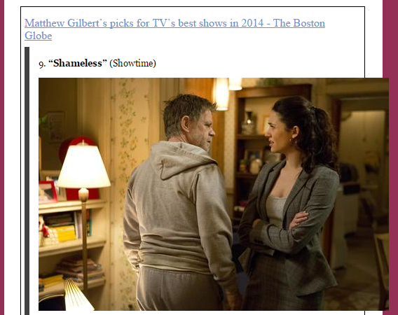

---

y por si las :fly: :fly: es buena idea :bulb: hacer algo así

```css
img, embed, object, video {
  max-width: 100%;
}
```
limitando la anchura máxima que pueden tomar los elementos multimedia.

---

#### Usa las propiedades ***srcset*** y ***sizes*** del _tag_ :muscle: `img` :muscle: o... el elemento `picture`
  
Así ayudaras al navegador a elegir la mejor imagen para utilizar en función de las condiciones del dispositivo.

\- ¿***srcset***, ***sizes***, `picture`... ayudar YO al NAVEGADOR :astonished:...? No entiendo nada _hulio_ :confused:
\- Son la solución **HTML** al _art direction problem_...
\- ¿_art direc_... _whaaaat_? 
\- :eye: :arrow_down:

---

##### _Art direction problem_

:wolf: en la pantalla de mi escritorio

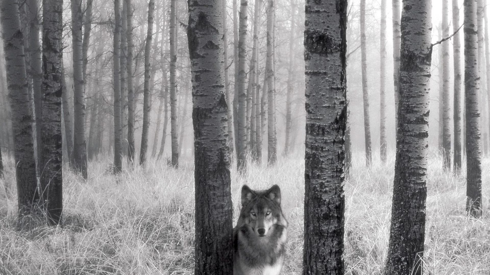

---

En la pantalla de mi :dollar: _Iphone_ :dollar: ... bonitos :evergreen_tree: :evergreen_tree: :evergreen_tree:


:rocket: Houston, tenemos un _art direction problem_... ¿qué hacemos?

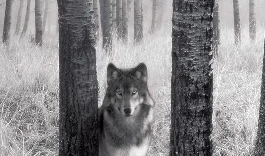

---

Pues hacemos algo así 

```css
@media (max-width: 320px) {
  .img-lobo {
    transform: scale(1.5)
  }
}
```

y arreglado...

:expressionless: mi perro tiene problemas más graves y sin nombre propio en inglés

---

:rage: Prueba con el gato, listillo :arrow_down:

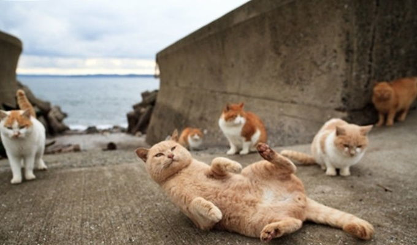

---

:sweat_smile: puedo contar los pixeles con los dedos de la mano ([aqui :link:](https://codepen.io/taciocamba/pen/porryYo))


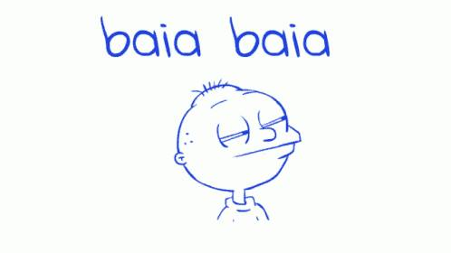

Con un escalado no podemos decidir en que zona de la imagen hacer foco y la imagen se ve muy pixelada cuando la ampliamos.

----

La solución al _art direction problem_ consiste en disponer de **varias versiones de la misma imagen** en las que nos centramos en lo que queremos mostrar.

Veamos esto con ***srcset***, ***sizes*** y los gatos
```html

```

Explicación :arrow_down:

---

```html
   srcset=" 
      gato-ciudad-280w.jpg 240w, 
      gato-ciudad-680w.jpg 680w
   " 
```

:arrow_up: le digo al navegador

> Tienes 2 imágenes de gatos disponibles una de 280w de ancho y otra de 680w. Elige la mejor en función de las carácterísticas del dispositivo

:warning: Los *widths* (`240w` y `680w`) son los anchos intrínsecos de la imagen ([mas info :link:](https://developer.mozilla.org/en-US/docs/Glossary/Intrinsic_Size))

En lugar de indicar los anchos intrínsecos de las imagenes (`240w`, `680w`, ..) puedes establecer las densidades de pixel que aplican a cada imagen (`2x`, `3x`...)

---

```html
   sizes=" 
      (min-width: 960px) 720px, 
      100vw 
```

:arrow_up: le digo al navegador

> Si el ancho del dispositivo es >= 960px entonces elige la imagen que mejor se ajuste a un ancho de 720px. Si ocurre lo contrario haz que la imagen se ajuste al ancho completo del *viewport* (y elige la mejor imagen para ello)

[Aquí :link:](https://html.com/attributes/img-srcset/#The_Markup) tenéis una explicación mucho mejor que la mía.

---

¿Se puede hacer mejor?

Por supuesto, con el elemento :sunglasses: `picture` :sunglasses: (cuidado que es su primerito dia en navegadores)

```html
<picture>
  <source 
    media="(max-width: 960px)" 
    srcset="gato-ciudad-280w.jpg"
  >
  
</picture>
```

de todos modos, [aqui :link:](https://googlesamples.github.io/web-fundamentals/fundamentals/design-and-ux/responsive/media.html) hay un ejemplo de alguien mucho mas listo

¿Y si os digo que también se hace todo lo de arriba no solo en función del ancho de pantalla del dispositivo sino también de su densidad de pixeles? :arrow_down:

 ---


 Una tabla (y un [ejemplo :link:](https://googlesamples.github.io/web-fundamentals/fundamentals/design-and-ux/responsive/sizes.html)) vale más que mil palabras... y un figura preguntando en [:crystal_ball: _stack overflow_ :crystal_ball: :link:](https://stackoverflow.com/questions/8785643/what-exactly-is-device-pixel-ratio) ya ni os digo. [Aquí :link:](https://datacadamia.com/web/css/pixel_ratio) también está muy bien explicado.

 
 

 TL;DR... ¿una :zap: actividad :zap: y tal...?

 ---

 #### Actividad 1

1) Elegid una imagen que os guste (:warning: con una resolución decente pero sin pasarse)
2) Haced 2 versiones más de ella (una para dispositivos móviles y otra para _tablets_) usando :muscle: _paint_ :muscle: o el editor que querais.
3) Usad ***srcset*** y ***sizes*** para cargarlas de forma condicional en función del ancho de pantalla.
4) Usad :sunglasses:`picture`:sunglasses: para hacer lo de arriba :arrow_up:

:zap: ***20 MINUTOS*** :zap:


---

#### ImageMagick

En la :zap: actividad :zap: anterior, os pedía que versionarais una imagen usando un editor de vuestra elección, así, a la buena de Dios.

Redimensionar, rotar, difuminar, cambiar la opacidad, recortar... y sobre todo **CONVERTIR** entre formatos de imagen son habilidades a dominar en este mundillo... y para dominar algo hacen falta buenas herramientas :wrench::nut_and_bolt::hammer:

:sparkles: Os presento [ImageMagick :link:](https://imagemagick.org) :sparkles: :arrow_down:

---

Espera, espera... eso es una herramienta de consola de comandos :scream::scream::scream:

Efectivamente... bienvenidos al mundo real :japanese_ogre::japanese_ogre: 

La parte buena es que os podéis hacer los _hackers_ delante de vuestras abuelas mientras redimensionais vuestro avatar de _Fortnite_.

Pero lo mas importante es que una vez dominada el flujo de trabajo se agiliza y además os permite automatizar tareas comunes con _scripting_.

Me has convencido, dale :fist::fist:

---

1) Instala desde [aqui :link:](https://imagemagick.org/script/download.php)
2) Verifica que todo va bien haciendo esto en la terminal :arrow_down:

```
magick logo: logo.gif
magick identify logo.gif
magick logo.gif win:
```

3) Si estas en Windows y no te funciona :disappointed::disappointed: instala este [dll :link:](https://docs.microsoft.com/en-us/cpp/windows/latest-supported-vc-redist?view=msvc-160) y si todo va bien...


---

##### Vale, ahora unos ejemplos

1) Convertimos el :wolf: de antes de .jpg a [.webp :link:](https://developers.google.com/speed/webp)

```
magick lobo-en-el-bosque.jpg -quality 50 -define webp:lossless=true lobo-en-el-bosque.webp
```

2) Redimensionamos los :cat::cat: de antes para que se queden a la mitad

```
magick gato-ciudad-680w.jpg -resize 50% gato-ciudad-340w.png 
```

3) Ahora quiero el logo de :sparkles:ImageMagick:sparkles: en b/n

```
magick imagemagick.jpg -monochrome imagemagick-bn-mal.png
```

---


4) Y para acabar, las tres primeras de golpe con la calculadora humana

```
magick actividad-calculo.jpg -resize 50% -monochrome actividad-calculo-magick.png
```

Por [aqui :link:](https://imagemagick.org/script/command-line-processing.php) tenéis la referencia para montaros bien los comandos de terminal :muscle:...

y a continuación... :grimacing::grimacing:

 :zap:actividad:zap: :arrow_down:

 ---
 #### Actividad 2

 1) Instala :sparkles:ImageMagick:sparkles: como vimos :arrow_up:
 2) Busca una imagen cualquiera en alta resolución
 3) Redimensionala al 75%, cambia su orientación y aplica un desenfoque (_blur_) a tu elección
 6) Conviertela a formato _webp_ sin pérdidas (_lossless_)
 7) Compara el tamaño en disco de la imagen original con la nueva...

y me contáis el resultado :smiley::smiley:

:zap: ***20 MINUTOS*** :zap:


---

### Imagenes en CSS

HTML dominado :+1::+1: pero... ¿CSS no tiene nada que decir :thinking:? 

Bueeeh, menos de lo habitual pero algo hay... siempre de la mano de la propiedad [background :link:)](https://www.w3schools.com/css/css_background.asp) :arrow_down:

---

#### ...exacto, las típicas `@media` queries

```css
.img-gato {
  width: 720px;
  background-image: url(assets/gato-ciudad-680w.jpg);
  background-repeat: no-repeat;
  background-size: contain;
  background-position-x: center;
}

@media (max-width: 960px) {
  .img-gato {
    width: 100vw;
    background-image: url(assets/gato-ciudad-280w.jpg);
  }
}
```

:trophy: Esta jugada seguro que se os ocurría sin ayuda :trophy:

---

#### La función ***image-set()*** (para tema *DPRs*)

Con esta :eyes: :warning: que esta recién salida del horno y tiene mal soporte (sólo *Chrome* y *Safari*, añadir `-webkit`). Pero nosotros siempre al limite :arrow_down:

```css
.img-gato {
  width: 720px;
  background-image: url(assets/gato-ciudad-680w.jpg);
  background-image: -webkit-image-set(  
    url(assets/gato-ciudad-280w.jpg) 1x,  
    url(assets/gato-ciudad-680w) 2x  
  );  
  background-image: image-set(  
    url(assets/gato-ciudad-280w) 1x,  
    url(assets/gato-ciudad-680w) 2x  
  );
  background-repeat: no-repeat;
  background-size: contain;
  background-position-x: center;
}

@media (max-width: 960px) {
  .img-gato {
    width: 100vw;
  }
}
```

---

#### ...aunque podemos hacer lo mismo con `@media` queries (otra vez :man_facepalming:)

```css
  .img-gato {
    width: 720px;
    background-image: url(assets/gato-ciudad-680w.jpg);
    background-repeat: no-repeat;
    background-size: contain;
    background-position-x: center;
  }

  @media (max-width: 960px) and (min-resolution: 2dppx), /* Sintaxis estandar */ 
  (-webkit-min-device-pixel-ratio: 2)  /* Navegador Safari y Android */ 
  {
    .img-gato {
      width: 100vw;
      background-image: url(assets/gato-ciudad-680w.jpg);
    }
  }
```

y hasta aquí

---

### Formatos de imagen y cuando usarlos para *dummies*

Aquí os dejo una imagen con *info* sobre esto

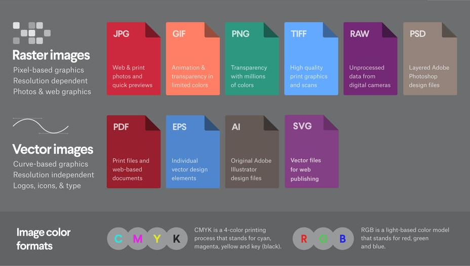

---

La diferencia entre imagen rasterizada y vectorial es difícil de ex...nahh :smile:

- Una imagen ráster (o *bitmap*) es una cuadricula de pixeles que si escala por encima de su resolución original... 😅
  
- Una imágen vectorial esta definida por expresiones matemáticas así que escala sin perdida de calidad

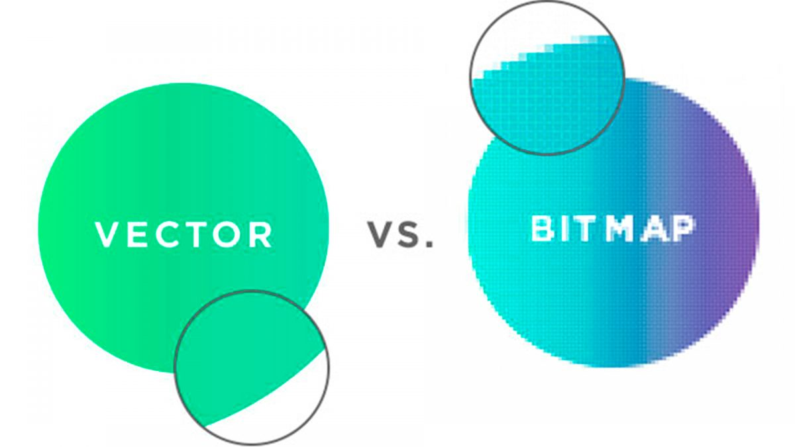

y es todo lo que tenéis que saber :triumph::triumph:

---

#### Imágenes ráster o *bitmaps*

:stop_sign: Antes de que veamos los principales tipos de imágenes ráster y cuando utilizarlos... :stop_sign:

---

##### *lossless* y *lossy* (podría ser el nombre de mis :dog::dog:)

Las imágenes son 1s y 0s - como cualquier entidad digital :nerd_face::nerd_face: - y el formato es sólo la manera en que estos bits estan ordenados y estructurados.

:ok_hand::ok_hand:... ¿pero que me estas contando? 

Pues que hay gente muy lista que hace cosas de gente muy lista con estos bits para que una imagen en lugar de ocupar 1 MB ocupe 500 KB, es decir comprime la imagen, y esto es lo que hacen los formatos de imagen de dos formas diferentes :arrow_down:

---

- *lossless* - Comprime la imagen de forma que podemos reconstruirla a su estado original sin perdida de información.
  
- *lossy* - Comprime la imagen a costa de determinadas propiedades de la original, p. ej. reduce el rango de colores. Si esto se hace de forma inteligente :nerd_face: al reconstruir la imagen el ojo humano no lo percibe.

Como era de esperar las *lossy* tienen mejores *ratios* de compresión y son ideales para *web*.

---

Aclarado :+1:. Ahora resumen de formatos ⚡ ⬇️

Primero las ráster

---

##### JPEG

*Lossy* en acción


---
Casos de uso :arrow_down:

- :+1: Ofrecen mucha flexibilidad en la edición y compresión, así que son ideales en entornos *web* donde es importante la velocidad de descarga.
- :+1: Imagenes para imprimir. :arrow_up: Resolución :arrow_down: Compresión... y al revés
- :+1: Ideales para imágenes de tamaño muy pequeño en plan *preview* para enviar por *email* o *avatares del *fortnite*


- :-1: Si necesitas transparencia... olvidate, no tienen canal de transparencia, usa mejor PNG o GIF.
- :-1: Necesitas hacer ediciones muy sofisticadas por capas y demás... nada, son imagenes planas donde todas las modificaciones se guardan en una sola capa. Usa PSD (Photoshop)

---

##### GIF

¿A quién no le gustán los GIFs de gatos? 🥳🥳... son *lossless* por cierto.


---
Casos de uso :arrow_down:

- :+1: Para animaciones web
- :+1: Necesitas transparencia.Los GIFs tienen un canal *alfa* transparente
- :+1: ¿Quiéres una imagen muy pequeña? GIF es tu imagen.

- :-1: Para imagenes de calidad fotográfica, no gracias 👋 . GIF tiene un limite de 256 colores, las fotos tienen miles... :facepalm:
- :-1: Si necesitas imprimir la imagen, por lo mismo que arriba :arrow_up:. Usa TIFF, PSD o JPG
- :-1: Ediciones por capas y bla bla... le pasa como a JPG
---

##### PNG

La niña bonita del mundo *web*, prácticamente un estándar y... *lossless*. Vamos a ver cuando usarlo y cuando no :arrow_down:

- :+1: Transparencia *over 9000*. Tienen un canal *alfa* variable que permite grados de transparencia (GIF es todo/nada) y con una buena profundidad de color
- :+1: Imagenes con un rango limitado de colores
- :+1: Imágenes de tamaño pequeño

- :-1: Fotos. Aunque la resolución y la profundidad de color esta bien resuelta... es *lossless* y para *web* va a ocupar demasiado espacio.
- :-1: ¿Tienes que imprimir?. PNG esta optimizado para pantallas :tv:... puedes imprimir pero... mejor JPEG o TIFF

---
##### TIFF

*Lossless* de altísima calidad.

- :+1: Para imprimir fotos en alta calidad, sobre todo en formatos grandes
- :+1: Para escanear fotos o documentos con la mejor calidad posible
- :-1: Demasiado bueno... y pesado para *web*. JPEG o PNG para imagenes de alta calidad en entornos *web*

y ahora las vectoriales :arrow_down:

---

##### PDF

> El *santo grial* de las copisterías...

- :+1: La mayoría de imprentas y copisterías te haran descuento :moneybag: si les llevas tus documentos en PDF... :laughing:. Es universal.
- :+1: Para mostrsa un documento en la *web* van muy bien ya que mantienen todo el diseño en un elemento, lo que lo hace más fácil de ver, descargar o imprimir.
- :-1: Si tienes que editar el diseño...mejor pasa de PDF, son buenos contenedores pero nada más.

---
##### EPS

El más triste de los formatos vectoriales (aunque puede incluir datos rasterizados). Sirve para hacer logos y... para hacer logos.

- :+1: ¿Necesitas un logo vectorial para tu empresa? EPS es lo que estás buscando.

:warning: No es recomendable usar EPS para cualquier cosa que no sea hacer logos

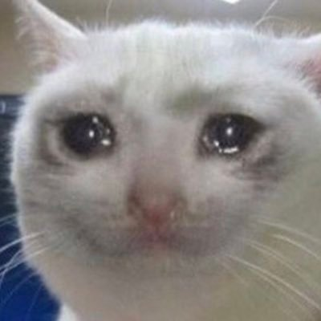

---
##### SVG

:trophy: SVG :trophy: puede ser buscado, indexado y comprimido en ficheros mas pequeños que otros formatos de imagen, vamos un *win-win* para *web*. Además se puede editar hasta con el :superhero_man: bloc de notas :superhero_man: al ser un formato basado en *XML*

- :+1: Gráficos y diagramas para web
- :-1: Imprimir entra en la ecuación
---

##### Tenemos un nuevo vecino en el barrio... WEBP

Soporta compresión *lossless* y *lossy* con mejores ratios en ambos casos que PNG y JPEG y calidades equivalentes. ¡Y transparencia! :scream::scream:

Demasiado bueno para ser cierto 🤔🤔... tiene truco... 

No lo tiene, sólo que es nuevo y en consecuencia no está tan bien soportado por los navegadores como otros formatos. [Aquí :link:](https://developers.google.com/speed/webp) una web con info detallada.

Os dejo por [aquí :link:](https://developer.mozilla.org/en-US/docs/Web/Media/Formats/Image_types) la tabla del MDN con un resumen de todo lo de arriba (más o menos) pero en inglés.

---

#### Optimización de imagenes

Antes de optimizar una *web* es buena idea :bulb: hacer un *benchmark* del sitio para afinar mejor el tiro 🎯. Os dejo por aquí unas cuantas herramientas para hacerlo :arrow_down:

- [Google PageSpeed Insights :link:](https://developers.google.com/speed/pagespeed/insights/)
- [Pingdom Tools :link:](https://tools.pingdom.com/)
- [GTMetrix :link:](https://gtmetrix.com/)
- [WebPageTest :link:](https://www.webpagetest.org/)

---

Cuando tengamos claro el estado de la web podemos usar las siguientes técnicas aplicadas a imagenes para tratar de optimizarlo

- [Elegir el formato adecuado de imagen](#elegir-el-formato-adecuado-de-imagen)
- [Redimensionar las imagenes antes de exportarlas](#redimensionar-las-imagenes-antes-de-exportarlas)
- [Comprimir las imagenes para reducir su tamaño](#comprimir-las-imagenes-para-reducir-su-tamaño)
- [Usar la técnica del *blur up* para cargar imagenes de baja calidad primero](#usar-la-técnica-del-blur-up-para-cargar-imagenes-de-baja-calidad-primero)
- [Usar *lazy loading*](#usar-lazy-loading)
- [CSS Sprites](#css-sprites)

---

##### Elegir el formato adecuado de imagen

No hay mucho que decir 😅... *WEBP* y *SVG* cuando se pueda y para todo lo deás... mirad [aqui :arrow_up:](#formatos-de-imagen-y-cuando-usarlos-para-dummies)

---

##### Redimensionar las imagenes antes de exportarlas

Esta técnica tampoco tiene mucho misterio... Si teneis imágenes de 1024 x 1024 px pero os basta con 500 x 500 ya sabeis, recortad :scissors: o redimensionad, cada pixel que os cargueis son menos bits que almacenar y descargar.

---

##### Comprimir las imagenes para reducir su tamaño

Otra técnica para genios :nerd_face: Podeis usar herramientas de escritorio como [RIOT :link:](https://riot-optimizer.com/) o alternativas online como [tinypng :link:](https://tinypng.com/).

Os prometo que lo que viene a continuación es más sofisticado :smile:

---

##### Usar la técnica del *blur up* para cargar imagenes de baja calidad primero

Esta técnica nace en el equipo de ingeniería de *Facebook*, que tiene que resolver los tiempos de carga lentos que se producen en sus apps debido al gran tamaño de las imagenes de fondo de los perfiles de sus usuarios... y es un ejemplo de pensamiento lateral e ingenio :nerd_face:, así que atentos :arrow_down:

---

1) Devolvemos una imagen muy pequeña, de unos 40 px de ancho
2) La escalamos mientras aplicamos un desenfoque gausssiano

En este punto el usuario vé una imagen de fondo que, debido al desenfoque, resulta agradable a la vista y da una idea de como se verá la imagen final.

3) Mientras todo esto ocurre, cargamos en el *background* la imagen de fondo definitiva y cuando este le damos el cambiazo *smoothly* 😎😎

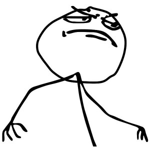

---

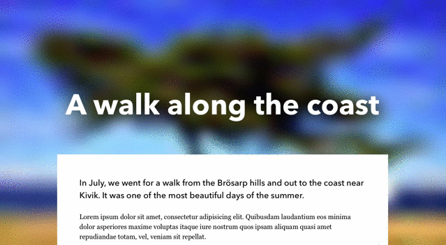

---

##### Usar *lazy loading*

Es una idea similar a la de :arrow_up:. 

Cargamos las imagenes que están en la parte baja de la pagina a medida que el usuario hace *scrolling*. Esta técnica ya es nativa en HTML.

Os dejo [info :link:](https://carlosazaustre.es/lazy-loading-image) detallada de como utilizarla.

---


---

##### CSS Sprites

Otra :bulb: idea top por aqui. Unimos varias imagenes en una imagen más grande y luego posicionando con CSS mostramos lo que queremos mostrar. Ya esta :nerd_face:.

Yo no lo veo claro :thinking: porque esa imagen *Frankenstein* va a pesar lo mismo o mas que sus partes por separado...

Ya, eso es cierto peeeero... el cliente se descarga el *sprite* en una sola petición en lugar de tener que hacer varias (tantas como imagenes). Veamos un ejemplo :arrow_down:

---

Tenemos estas tres banderas :arrow_right:  y hacemos esto :arrow_down:

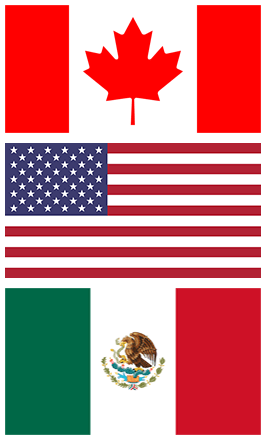

```css
.flags-canada, .flags-mexico, .flags-usa {
  background-image: url('../images/flags.png');
  background-repeat: no-repeat;
}

.flags-canada {
  height: 128px;
  background-position: -5px -5px;
}

.flags-usa {
  height: 135px;
  background-position: -5px -143px;
}

.flags-mexico {
  height: 147px;
  background-position: -5px -288px;
}
```

Y aqui un enlace al [pen :link:](https://codepen.io/taciocamba/pen/xxLYLOq)

---

Ufff preparar estos estilos a mano... :fearful::fearful:

Haya calma... primero crear el sprite con...  :mage: [ImageMagick](#imagemagick) :mage: así

```
convert *.png -append sprites.png # append vertically
convert *.png +append sprites.png # append horizontally
```

y luego tenemos este servicio online para generar los estilos [spritecow :link:](http://www.spritecow.com/) :cow:

Por cierto, si os preguntais si un sprite es mejor horizontal o vertical la respuesta es... ninguno... Compactalo en un grid lo mas pequeño dimensionalmente que puedas... así... a ojo :eye:

Venga ¿porque no? :zap: actividad :zap: :arrow_down:

---

#### Actividad 3

Busca las imágenes con los logotipos de 3 empresas y usando la receta de arriba

1) Crea el sprite con :mage: [ImageMagick](#imagemagick) :mage:
2) Usando [spritecow :link:](http://www.spritecow.com/) :cow: genera los estilos
3) Reutiliza el HTML del [pen :link:](https://codepen.io/taciocamba/pen/xxLYLOq) anterior para mostrar los 3 logos por separado.


----

##### DataURIs

Hay otra técnica sencilla que nos ahorrará peticiones y que consiste en embeber las imagenes como texto codificado, generalmente en [base64 :link:](https://developer.mozilla.org/es/docs/Glossary/Base64), directamente en el HTML o en el CSS. :eyes: Veamos dos ejemplos

###### CSS

```css
div {
  background:
    url(data:image/gif;base64,R0lGODlhEAAQAMQAAORHHOVSKudfOulrSOp3WOyDZu6QdvCchPGolfO0o/XBs/fNwfjZ0frl3/zy7////wAAAAAAAAAAAAAAAAAAAAAAAAAAAAAAAAAAAAAAAAAAAAAAAAAAAAAAAAAAAAAAACH5BAkAABAALAAAAAAQABAAAAVVICSOZGlCQAosJ6mu7fiyZeKqNKToQGDsM8hBADgUXoGAiqhSvp5QAnQKGIgUhwFUYLCVDFCrKUE1lBavAViFIDlTImbKC5Gm2hB0SlBCBMQiB0UjIQA7)
    no-repeat
    left center;
  padding: 5px 0 5px 25px;
}
```

###### HTML

```html

```
---

El formato general es

```html
data:[<mime type>][;charset=<charset>][;base64],<encoded data>
```

Podeis usar esta herramienta para [convertir a base64 :link:](https://www.base64decode.org/)...

... y aquí el [pen :link:](https://codepen.io/taciocamba/pen/VwzQxVB)...

y ahora una :zap: actividad :zap:

---

#### Actividad 4

Repíte la [actividad anterior](#actividad-3) usando *DataURIs* en lugar de *sprites*.


---