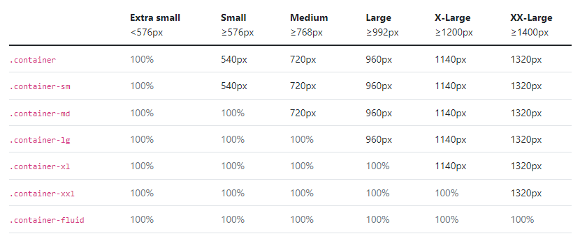
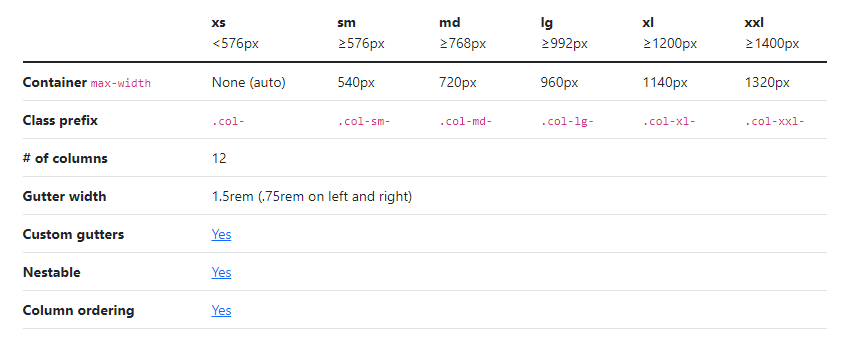
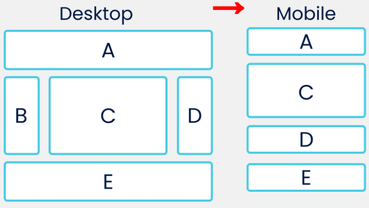
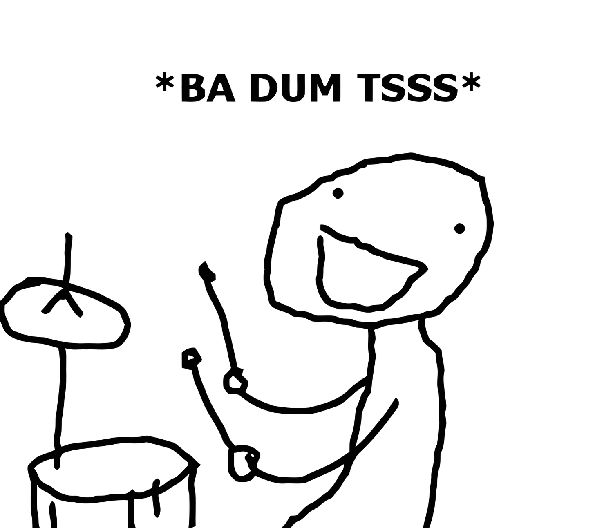

<style>
   section {
       font-size: 24px;
   }
</style>

# Bootstrap

---

## Contenidos

- [¿De qué va *Bootstrap* y como empiezo?](#de-que-va-bootstrap-y-como-empiezo) 🤔
- [Diseñando con *Bootstrap* y sus 12 columnas](#diseñando-con-bootstrap-y-sus-12-columnas)
- [Comodidades *Bootstrap*](#comodidades-bootstrap)
- [Componentes por favor](#componentes-por-favor) :pray:

---

## ¿De qué va *Bootstrap* y como empiezo?

[Bootstrap :link:](https://getbootstrap.com/) se autodefine como un framework CSS que permite construir con facilidad sitios web responsivos y orientados a dispositivos móviles.

Nosotros lo definiremos como una hoja de estilos (escrita es *Sass*) muy bien pensada que nos ahorra trabajo y también nos trae algunos componentes muy bonitos (*popovers*, *toast*, *tooltips*...) 🥳

---

### ¿Cómo nos ponemos en marcha con *Bootstrap*?


Muy sencillo, añadimos el siguiente `<link>` a nuestro `<head>`, al principio de de cualquier otra hoja de estilo

```html
<link href="https://cdn.jsdelivr.net/npm/bootstrap@5.1.3/dist/css/bootstrap.min.css" 
      rel="stylesheet" 
      integrity="sha384-1BmE4kWBq78iYhFldvKuhfTAU6auU8tT94WrHftjDbrCEXSU1oBoqyl2QvZ6jIW3" 
      crossorigin="anonymous">
```

Con :arrow_up: tendríamos lo básico para tirar, salvo algunos componentes que requieren *js*, y en caso de usarlos, añadiremos al final del `<body>`

```html
<script src="https://cdn.jsdelivr.net/npm/bootstrap@5.1.3/dist/js/bootstrap.bundle.min.js" 
        integrity="sha384-ka7Sk0Gln4gmtz2MlQnikT1wXgYsOg+OMhuP+IlRH9sENBO0LRn5q+8nbTov4+1p" 
        crossorigin="anonymous"></script>
```

y ya esta 🥳

---

### Algo importante sobre responsividad

Como decíamos al principio, *Bootstrap* se centra en el diseño responsivo y *mobile-first* y con este objetivo, establece unas anchuras fijas o *breakpoints* que disparan cambios en nuestro diseño a través de las clases con las que marcamos los elementos de nuestra plantilla. Por aquí ⬇️ la tabla resumen de los *breakpoints*

---

|Breakpoint|Class infix|Dimensions|
|--- |--- |--- |
|X-Small|None|<576px|
|Small|sm|≥576px|
|Medium|md|≥768px|
|Large|lg|≥992px|
|Extra large|xl|≥1200px|
|Extra extra large|xxl|≥1400px|

---

Como podréis imaginar 🤓, estos *breakpoints* estan implementados en *Sass*

```scss
// No media query necessary for xs breakpoint as it's effectively `@media (max-width: 0) { ... }`
@include media-breakpoint-down(sm) { ... }
@include media-breakpoint-down(md) { ... }
@include media-breakpoint-down(lg) { ... }
@include media-breakpoint-down(xl) { ... }
@include media-breakpoint-down(xxl) { ... }

// Example: Style from medium breakpoint and down
@include media-breakpoint-down(md) {
  .custom-class {
    display: block;
  }
}
```

---

 y compilan a su respectiva `@media` query

 ```css
 // X-Small devices (portrait phones, less than 576px)
// No media query for `xs` since this is the default in Bootstrap

// Small devices (landscape phones, 576px and up)
@media (min-width: 576px) { ... }

// Medium devices (tablets, 768px and up)
@media (min-width: 768px) { ... }

// Large devices (desktops, 992px and up)
@media (min-width: 992px) { ... }

// X-Large devices (large desktops, 1200px and up)
@media (min-width: 1200px) { ... }

// XX-Large devices (larger desktops, 1400px and up)
@media (min-width: 1400px) { ... } 
 ```

 pero para nosotros esto es transparente 😌

 ---

 ## Diseñando con *Bootstrap* y sus 12 columnas

 Vale 👌, como empiezo a utilizar *Bootstrap*, ¿cual es su 🍞 and 🧈?

 ---

 ### Containers

 Pues eso, el bloque fundamental de organización de contenido en *Bootstrap* son sus *containers*. Os explico muy rápido ⚡ cómo funcionan

 > Metéis en un `<div class=container>` lo que queráis y ya :sunglasses:

 ...bueno, no es tan fácil, me dejo algún detalle ⬇️

 ---

 Hay 3 tipos de *containers*

- `.container`, que fija un `max-width` para cada *breakpoint*
- `.container-fluid`, que fija `width: 100%` para todos los *breakpoints*
- `.container-{breakpoint}`, que hace `width: 100%` hasta el *breakpoint* especificado

---

Aqui tenéis la tabla resumen



---

### Grid

Y ahora el *grid* de *Bootstrap*, que se explica mejor con un ejemplo

```html
<div class="container">
  <div class="row">
    <div class="col">
      Column
    </div>
    <div class="col">
      Column
    </div>
    <div class="col">
      Column
    </div>
  </div>
</div>
```

--- 

como 👀, se basa en 3 elementos

- Un `<div class="container"></div>` que aloja todo el *layout*
- Un `<div class="row"></div>` por cada fila
- Un `<div class="col"></div>` por cada columna

---

¿Y como incorporamos responsividad al *grid*? Otra tablita 😅



---

Un dato importante sobre el grid de *Bootstrap* es que divide el *layout* en 12 columnas (si os fijáis 👀, todos los anchos de los *breakpoints* son divisibles entre 12)

Esto nos permite personalizar el ancho que ocupa cada *item* dentro de su fila. Ejemplo ⬇️

---

```html
<div class="container">
  <div class="row">
    <div class="col">
      1 of 3
    </div>
    <div class="col-6">
      2 of 3 (wider)
    </div>
    <div class="col">
      3 of 3
    </div>
  </div>
  <div class="row">
    <div class="col">
      1 of 3
    </div>
    <div class="col-5">
      2 of 3 (wider)
    </div>
    <div class="col">
      3 of 3
    </div>
  </div>
</div>
```

Como véis, fijamos el ancho de la 2da columna de la 1ra fila a 6 con `class="col-6"`, mientras que la 1ra y la 3ra ocuparan 3 y 3.

---

También podemos hacer que el ancho de cada *item* se ajuste a su contenido

```html
<div class="container">
  <div class="row justify-content-md-center">
    <div class="col col-lg-2">
      1 of 3
    </div>
    <div class="col-md-auto">
      Variable width content
    </div>
    <div class="col col-lg-2">
      3 of 3
    </div>
  </div>
  <div class="row">
    <div class="col">
      1 of 3
    </div>
    <div class="col-md-auto">
      Variable width content
    </div>
    <div class="col col-lg-2">
      3 of 3
    </div>
  </div>
</div>
```

---

Como puntos destacables del código de arriba

- `<div class="col-md-auto">` - El ancho de la columna se ajusta al tamaño de su contenido
- `<div class="row justify-content-md-center">` - Centra todas las columnas de la fila para pantallas con anchos >= `md`
- `<div class="col col-lg-2">` - El *item* ocupa 2 columnas para pantallas con anchos >= `lg`

---

Si queremos personalizar el tamaño de los espacios entre items del *grid* (*gutters*) lo podemos hacer así

```html
<div class="container px-4">
  <div class="row gx-5">
    <div class="col">
     <div class="p-3 border bg-light">Custom column padding</div>
    </div>
    <div class="col">
      <div class="p-3 border bg-light">Custom column padding</div>
    </div>
  </div>
</div>
```

---

- `<div class="container px-4">` - Establece el padding horizontal del container a 4 (ya vemos esto mas adelante)
- `<div class="row gx-5">` - Espaciado horizontal entre items con un valor de 5
- `<div class="p-3 border bg-light">` - Padding a 3, bordes y color de fondo gris claro

---

## Comodidades Bootstrap

*Bootstrap* provee de una serie de clases de utilidad (*a.k.a* comodidades). Vamos a verlas 👀

---

### *Background*

Para el color tenemos estas clases (también os pongo las de texto)

```html
<div class="p-3 mb-2 bg-primary text-white">.bg-primary</div>
<div class="p-3 mb-2 bg-secondary text-white">.bg-secondary</div>
<div class="p-3 mb-2 bg-success text-white">.bg-success</div>
<div class="p-3 mb-2 bg-danger text-white">.bg-danger</div>
<div class="p-3 mb-2 bg-warning text-dark">.bg-warning</div>
<div class="p-3 mb-2 bg-info text-dark">.bg-info</div>
<div class="p-3 mb-2 bg-light text-dark">.bg-light</div>
<div class="p-3 mb-2 bg-dark text-white">.bg-dark</div>
<div class="p-3 mb-2 bg-body text-dark">.bg-body</div>
<div class="p-3 mb-2 bg-white text-dark">.bg-white</div>
<div class="p-3 mb-2 bg-transparent text-dark">.bg-transparent</div>
```

y si queréis un gradiente basta con añadir `bg-gradient`, por ejemplo

```html
<div class="p-3 mb-2 bg-primary bg-gradient text-white">.bg-primary</div>
```

---

### *Borders*

Y a riesgo de ponerme borde 😅, podemos añadir bordes ➕

```html
<span class="border"></span>
<span class="border-top"></span>
<span class="border-end"></span>
<span class="border-bottom"></span>
<span class="border-start"></span>
```

y quitarlos ➖

```html
<span class="border-0"></span>
<span class="border-top-0"></span>
<span class="border-end-0"></span>
<span class="border-bottom-0"></span>
<span class="border-start-0"></span>
```

---

Cambiar su color 🌈

```html
<span class="border border-primary"></span>
<span class="border border-secondary"></span>
<span class="border border-success"></span>
<span class="border border-danger"></span>
<span class="border border-warning"></span>
<span class="border border-info"></span>
<span class="border border-light"></span>
<span class="border border-dark"></span>
<span class="border border-white"></span>
```

y su grosor

```html
<span class="border border-1"></span>
<span class="border border-2"></span>
<span class="border border-3"></span>
<span class="border border-4"></span>
<span class="border border-5"></span>
```

---

... y también redondear los vertices ⚪

```html


```

...utilizando mayor o menor radio de redondeo

```html


```

---

### *Display*

*Bootstrap* también nos facilita clases para la propiedad `display`

```html
<div class="d-inline p-2 bg-primary text-white">d-inline</div>
<span class="d-block p-2 bg-dark text-white">d-inline</span>
```

- `d-inline` equivale a `display: inline` para el elemento de bloque `<div>`
- `d-block` equivale a `display: block` para el elemento en linea `<span>`

---

La sintaxis generalizada para esta clase es 

- `d-{valor}` para pantallas *xs*
- `d-{breakpoint}-{valor} ` para el resto

Y `valor` puede ser `none, inline, inline-block, block, grid, table, table-cell, table-row, flex, inline-flex`

---

Esta clase resulta muy útil para esconder cosas, p. ej.

```css
<div class="d-lg-none">hide on lg and wider screens</div>
<div class="d-none d-lg-block">hide on screens smaller than lg</div>
```

- `<div class="d-lg-none">` que escondería el `<div>` en dispositivos con pantallas >= `lg`
- `<div class="d-none d-lg-block">` que oculta el `<div>` en dispositivos pequeños (`xs`)

---

### *Flex*

Y si amigos, *Bootstrap* también tiene cosas para nosotros en lo que a *Flexbox* se refiere. Y no me refiero solo a `display: flex` como se puede 👀 arriba, sino a todo lo demás ⬇️

---

#### *Direction*

P. ej.

```html
<div class="d-flex flex-row bd-highlight mb-3">
  <div class="p-2 bd-highlight">Flex item 1</div>
  <div class="p-2 bd-highlight">Flex item 2</div>
  <div class="p-2 bd-highlight">Flex item 3</div>
</div>
<div class="d-flex flex-row-reverse bd-highlight">
  <div class="p-2 bd-highlight">Flex item 1</div>
  <div class="p-2 bd-highlight">Flex item 2</div>
  <div class="p-2 bd-highlight">Flex item 3</div>
</div>
```

- `<div class="d-flex flex-row bd-highlight mb-3">` que marca el `<div>` como *flex container*, establece `flex-direction: row` y `margin-bottom` a 3
- `<div class="d-flex flex-row-reverse bd-highlight">` que marca el `<div>` como *flex container* y establece `flex-direction: row-reverse`

---

#### Wrap

Otra de las propiedades fundamentales

```html
<div class="d-flex flex-nowrap"> No Wrap </div>
<div class="d-flex flex-wrap"> Wrap </div>
<div class="d-flex flex-wrap-reverse"> Wrap reverse </div>
```

---

#### *Justify content* y *Align items*

Recordad que *justify* es para organizar los *items* respecto al eje horizontal y *align* respecto al vertical.

```html
<div class="d-flex justify-content-start">...</div>
<div class="d-flex justify-content-end">...</div>
<div class="d-flex justify-content-center">...</div>
<div class="d-flex justify-content-between">...</div>
<div class="d-flex justify-content-around">...</div>

<div class="d-flex align-items-start">...</div>
<div class="d-flex align-items-end">...</div>
<div class="d-flex align-items-center">...</div>
<div class="d-flex align-items-baseline">...</div>
<div class="d-flex align-items-stretch">...</div>
```

---

#### *Order*

Y poniendo un poco de orden 

```html
<div class="d-flex flex-nowrap">
  <div class="order-3 p-2">First flex item</div>
  <div class="order-2 p-2">Second flex item</div>
  <div class="order-1 p-2">Third flex item</div>
</div>
```

Tiene alguna clase más que aplica a los *flex items* pero permitidme ser perezoso y remitiros a la [documentación :link:](https://getbootstrap.com/docs/4.0/utilities/flex/) ya que son menos usadas.

---

### *Sizing*

Si queremos actuar sobre anchos y altos de elementos de forma fácil (👀👀 en %), podemos usar las siguientes clases

```html
<div class="w-25 p-3" style="background-color: #eee;">Width 25%</div>
<div class="w-50 p-3" style="background-color: #eee;">Width 50%</div>
<div class="h-75 p-3" style="background-color: #eee;">Height 75%</div>
<div class="h-100 p-3" style="background-color: #eee;">Height 100%</div>
```

---

También tenemos un *shortcut* para `max-width` y `max-height`

```html


```

---

### Dame un poco de *spacing* por favor...

*A.k.a* vamos a *ñapearlo* todo con `margin` y `padding`. 

Funciona de forma equivalente a otras clases anteriores con un añadido ⬇️

- `{property}{sides}-{size}` para dispositivos `xs`
- `{property}{sides}-{breakpoint}-{size}` para el resto
  
donde

- `property` puede ser 
  - `m` para margenes
  - `p` para *padding*

---

- `sides` toma valores entre los siguientes
  - `t` para `top`
  - `b` para `bottom`
  - `l` a.k.a `left`
  - `r` equivale a `right`
  - `x` equivale a `left` y `right`
  - `y` se refiere a `top` y `bottom`
  - Si va vacio aplica a los 4 lados

---

y finalmente

- `size` que puede valer
  - `0` - que eliminaría el margen o *padding*
  - `1` - `$spacer` * 0.25
  - `2` - `$spacer` * 0.5
  - `3` - `$spacer`
  - `4` - `$spacer` * 1.5
  - `5` - `$spacer` * 3
  - `auto` - `margin: auto`

Aclarar que `$spacer` es una variable definida en el *Sass* de *Bootstrap* que vale *16px*

---

y un ejemplo de las clases antes de compilar

```scss
.mt-0 {
  margin-top: 0 !important;
}

.ml-1 {
  margin-left: ($spacer * .25) !important;
}

.px-2 {
  padding-left: ($spacer * .5) !important;
  padding-right: ($spacer * .5) !important;
}

.p-3 {
  padding: $spacer !important;
}
```

---

### *Bootstrap* también trae magia para los que tienen algo que ocultar

Si queremos que algo no se vea basta con hacer

```html
<div class="visible">...</div>
<div class="invisible">...</div>
```

pero cuidado ⚠️, el elemento sigue ahí, ocupando espacio como Harry Potter :mage_man:, sólo que no lo veis. No equivale a  `display: none`.

---


## Actividad 1

Replica el *layout* del ejercicio 2 de la tarea entregable 2 usando *Bootstrap*



---


## Actividad 2s

Replica el *layout* del ejercicio 3 de la tarea entregable 2 usando *Bootstrap*


---

## Componentes por favor :pray:

Bueno, *Bootstrap* los regala, así que vamos a ver sólo dos o tres 😅

---

### *Navs*

Lo vemos con ejemplos

```html
<nav class="nav">
  <a class="nav-link active" aria-current="page" href="#">Active</a>
  <a class="nav-link" href="#">Link</a>
  <a class="nav-link" href="#">Link</a>
  <a class="nav-link disabled">Disabled</a>
</nav>
```

Como veis :eyes: hay 2 clases importantes `nav` y `nav-item` que se explican solas.

Fijaros en el `disabled` del último enlace, que lo desactiva.

---

y si nos gustan las pestañitas, podemos añadir `nav-tabs`

```html
  <ul class="nav nav-tabs">
    <li class="nav-item">
      <a class="nav-link active" aria-current="page" href="#">Active</a>
    </li>
    <li class="nav-item">
      <a class="nav-link" href="#">Link</a>
    </li>
    <li class="nav-item">
      <a class="nav-link" href="#">Link</a>
    </li>
    <li class="nav-item">
      <a class="nav-link disabled">Disabled</a>
    </li>
  </ul>
```

Por si alguién no lo vé se hace con la clase `nav-tabs`

---

También tenemos *pills*

```html
<nav class="nav nav-pills">
  <a class="nav-link active" aria-current="page" href="#">Active</a>
  <a class="nav-link" href="#">Link</a>
  <a class="nav-link" href="#">Link</a>
  <a class="nav-link disabled">Disabled</a>
</nav>
```

👁️ clase `nav-pills`

---

y cómo está basado en *flexbox*, podéis hacer que los *items* del menú rellenen todo el espacio

```html
<nav class="nav nav-fill">
  <a class="nav-link active" aria-current="page" href="#">Active</a>
  <a class="nav-link" href="#">Link</a>
  <a class="nav-link" href="#">Link</a>
  <a class="nav-link disabled">Disabled</a>
</nav>
```

⚠️ clase `nav-fill`

---

o de forma similar, podéis distribuir los enlaces de forma regular con `nav-justified`

```html
<nav class="nav nav-pills nav-justified">
  <a class="nav-link active" aria-current="page" href="#">Active</a>
  <a class="nav-link" href="#">Link</a>
  <a class="nav-link" href="#">Link</a>
  <a class="nav-link disabled">Disabled</a>
</nav>
```

---

Y si tendéis a la verticalidad tenéis la clase `flex-column`

```html
<nav class="nav flex-column">
  <a class="nav-link active" aria-current="page" href="#">Active</a>
  <a class="nav-link" href="#">Link</a>
  <a class="nav-link" href="#">Link</a>
  <a class="nav-link disabled">Disabled</a>
</nav>
```

pero basta ya de `navs` 😫 vamos con su versión seria...

---
<style scoped>
pre {
   font-size: 0.3rem;
}
</style>

### *Navbar*

Por aqui ⬇️ un ejemplo completito

```html
<nav class="navbar navbar-expand-lg navbar-light bg-light">
   <div class="container-fluid">
      <a class="navbar-brand" href="#">Navbar</a>
      <button class="navbar-toggler" 
              type="button" 
              data-bs-toggle="collapse" 
              data-bs-target="#navbarSupportedContent" 
              aria-controls="navbarSupportedContent" 
              aria-expanded="false" 
              aria-label="Toggle navigation">
      <span class="navbar-toggler-icon"></span>
      </button>
      <div class="collapse navbar-collapse" id="navbarSupportedContent">
         <ul class="navbar-nav me-auto mb-2 mb-lg-0">
            <li class="nav-item">
               <a class="nav-link active" aria-current="page" href="#">Home</a>
            </li>
            <li class="nav-item">
               <a class="nav-link" href="#">Link</a>
            </li>
            <li class="nav-item dropdown">
               <a class="nav-link dropdown-toggle" 
                  href="#" id="navbarDropdown" 
                  role="button" 
                  data-bs-toggle="dropdown" 
                  aria-expanded="false">
               Dropdown
               </a>
               <ul class="dropdown-menu" aria-labelledby="navbarDropdown">
                  <li><a class="dropdown-item" href="#">Action</a></li>
                  <li><a class="dropdown-item" href="#">Another action</a></li>
                  <li>
                     <hr class="dropdown-divider">
                  </li>
                  <li><a class="dropdown-item" href="#">Something else here</a></li>
               </ul>
            </li>
            <li class="nav-item">
               <a class="nav-link disabled">Disabled</a>
            </li>
         </ul>
         <form class="d-flex">
            <input class="form-control me-2" type="search" placeholder="Search" aria-label="Search">
            <button class="btn btn-outline-success" type="submit">Search</button>
         </form>
      </div>
   </div>
</nav>
```

---

tan completito que no cabe en la diapositiva y he tenido que reducier el tamaño de fuente a prueba de miopes...pero lo comentamos por aquí

- `navbar`  - Se explica solo...
- `navbar-expand-lg`  - `navbar-expand-{sm,mg,lg,xl}` para que el menú colapse adecuadamente en el *breakpoint* establecido
- `navbar-light` - Os hacéis a la idea que es el típico tema de *Bootstrap* que colorea el fondo y demás
- `navbar-brand` - Que contiene el logo de la marca y lo excluye del colapso del menú
- `navbar-toggler` - Es el boton que contiene también el icono para expandir el menú cuando colapsa

---


- `collapse` y `navbar-collapse` - Marca el elemento contenedor de los *items* del menú que colapsarán

Lo que sigue os suena porque es un `nav` como el que vimos arriba.

Y con esto... ***el menú esta servido***...
  


[Por aquí :link:](https://codepen.io/taciocamba/pen/PoJqRLe) el *pen*

---

### Modal
<style scoped>
pre {
   font-size: 0.5rem;
}
</style>


Otro componente bastante utilizado es el de los modales o cuadros de diálogo

```html
<!-- Button trigger modal -->
<button type="button" class="btn btn-primary" data-bs-toggle="modal" data-bs-target="#staticBackdrop">
  Launch static backdrop modal
</button>

<!-- Modal -->
<div class="modal fade" id="staticBackdrop" 
     data-bs-backdrop="static" 
     data-bs-keyboard="false" 
     tabindex="-1" 
     aria-labelledby="staticBackdropLabel" 
     aria-hidden="true">
  <div class="modal-dialog">
    <div class="modal-content">
      <div class="modal-header">
        <h5 class="modal-title" id="staticBackdropLabel">Modal title</h5>
        <button type="button" 
                class="btn-close" 
                data-bs-dismiss="modal" 
                aria-label="Close"></button>
      </div>
      <div class="modal-body">
        ...
      </div>
      <div class="modal-footer">
        <button type="button" class="btn btn-secondary" data-bs-dismiss="modal">Close</button>
        <button type="button" class="btn btn-primary">Understood</button>
      </div>
    </div>
  </div>
</div>
```

---

este componente no tiene mucho misterio ...

- `modal`, `modal-dialog`, `modal-content`, `modal-header` y `modal-title` - se explican solos
- `fade` - es la animación que aplica al modal cuando aparece y desaparece

---

## Cards

A todo el mundo le gustan las cartas ⬇️

```html
<div class="card" style="width: 18rem;">
  
  <div class="card-body">
    <h5 class="card-title">Card title</h5>
    <p class="card-text">Some quick example text to build on the card title and make up the bulk of the card's content.</p>
    <a href="#" class="btn btn-primary">Go somewhere</a>
  </div>
</div>
```

En realidad es un componente muy sencillo que se monta con un par de clases como 👀


