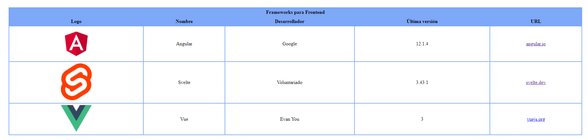
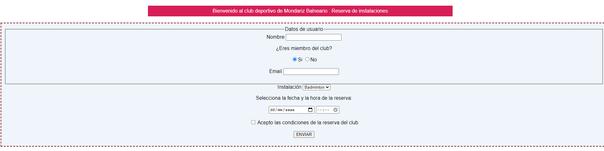
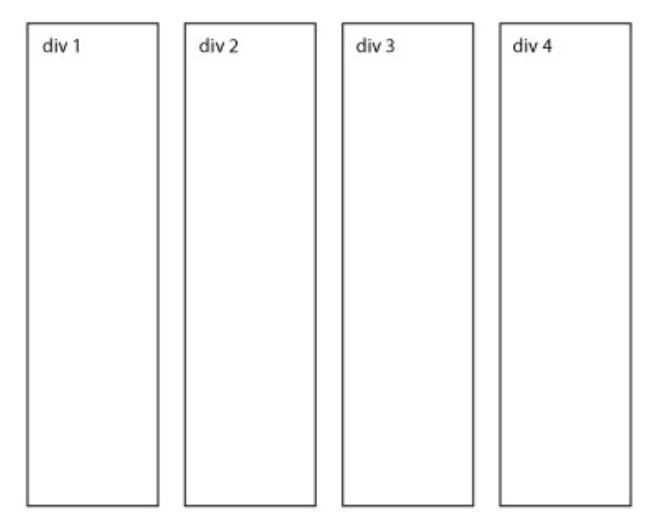
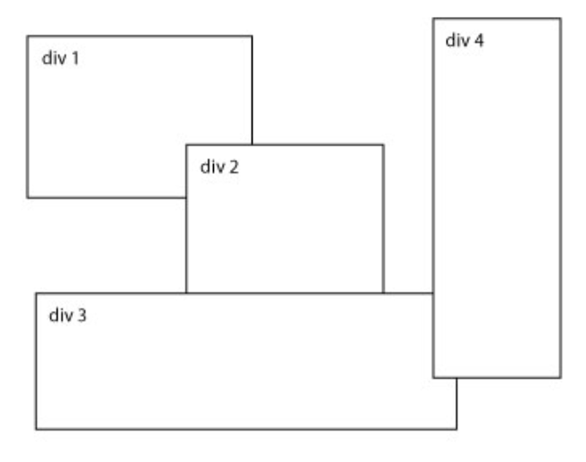
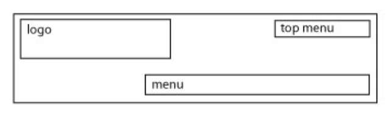

# Tarea Evaluable 1

## Criterios de evaluación

Los ejercicios propuestos a continuación engloban el contenido teórico impartido en las 3 primeras sesiones de la asignatura, fundamentalmente un repaso de _HTML5_ y una introducción a _CSS3_.

La tarea deberá ser entregada como muy tarde el día **_22 de octubre de 2021_**, con una prorroga de 3 días que conllevará la perdida de 1 punto por cada día de retraso, esto es:

- Entrega el día **_23 de octubre de 2021_** : -1 punto
- Entrega el día **_24 de octubre de 2021_** : -2 punto
- Entrega el día **_25 de octubre de 2021_** : -3 puntos

Transcurrido los plazos arriba expuestos, la tarea puntuará automáticamente con un **0**, no obstante se corregirá a **petición del alumno** con fines de autoevaluación.

No se aplicarán criterios estéticos en la evaluación de ninguno de los ejercicios propuestos.

La tarea se entregará usando el medio que el alumno estime oportuno (email, repositorio Git, ...)

## Ejercicios

### 1. Creación de una tabla HTML (**25%**)

Reproduce la siguiente tabla:

La temática y los estilos son de libre elección pero la tabla debe incluir al menos los siguientes elementos:

- Un encabezado que se extienda a lo largo de todo el ancho de la tabla (propiedad _colspan_)
- Una columna con imágenes
- Una columna con enlaces

### 2. Creación de un formulario HTML (**25%**)

Reproduce el siguiente formulario:

La temática y los estilos son de libre elección pero el formulario debe incluir al menos los siguientes elementos:

- Un grupo de campos (tag _fieldset_)
- Inputs de tipo _text_, _email_, _radio_, _time_, _date_, y _checkbox_
- Input con lista y _datalist_

### 3. Posicionamiento CSS

#### Diseño en columnas simples (**10%**)

1. Crea un fichero HTML con 4 _divs_ y pon un texto cualquiera dentro de ellos.
2. Dales un borde que los delimite
3. Posiciona cada _div_ de forma **absoluta** reproduciendo el diseño siguiente:

#### Diseño arbitrario (**10%**)

1. Crea un fichero HTML con 4 _divs_ y pon un texto cualquiera dentro de ellos.
2. Dales un borde que los delimite.
3. Posiciona cada _div_ de forma **absoluta** reproduciendo el diseño siguiente:

#### Diseño de encabezado (**10%**)

1. Añade un _div_ con una anchura de 800 _px_ y una altura de 150 _px_ y agregale un borde.
2. Declara su posicion **relativa**.
3. Crea 3 _divs_ dentro del _div_ anterior y ponles el texto que quieras.
4. Posiciona cada elemento de forma **absoluta** de modo que el diseño se asemeje al siguiente:

### 4. Web de temática libre (_20%_)

Diseña una web de temática libre que cumpla los siguientes requisitos:

- Incluir al menos un ejemplo de los tags _figure_, _video_ y _audio_
- Un ejemplo de CSS _gradient_, _transition_ y _animation_
